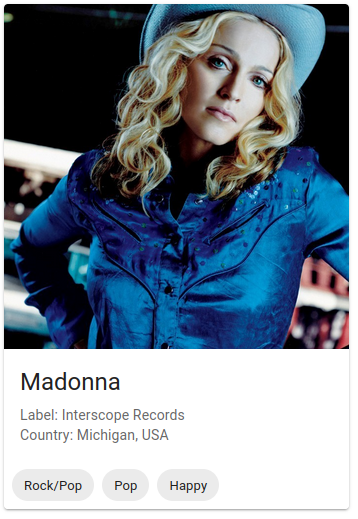

# LAB 10 - React Router and Material UI

## React Router

### Task 1 - routing and linking

1. Create a new component in `components/Bouncer.js`, with a heading containing the text "Bouncer Page"
2. In this component, add a `Link` component that will redirect to the home page (`/`)
3. In `App.js`, add a `Route` that will handle the path `/bouncer`, and render the `Bouncer` component in it
4. In `components/Home.js`, add a `Link` that will redirect to the `/bouncer` page
5. You should now be able to switch between the `Home` and `Bouncer` pages using the links

### Task 2 - `history.push()`

1. In the `components/Bouncer.js` file, use the `useHistory` hook to get the `history` object
2. Use the `useEffect` hook and a `setTimeout` function to achieve the following effect:
3. When the user lands on the `Bouncer` page, after a timeout of 5 seconds they get redirected back to the `Home` (`/`) page.

### Task 3 - `useLocation()`

1. Create a new component in `components/NotFound.js`, with a heading containing the text "Page Not Found"
2. In this component, add a `Link` component that will redirect to the home page (`/`)
3. Use the `useLocation` hook to get the current `location` object
4. Render a paragraph `
`, that will print the current location pathname, in a sentence like `{pathname} not found`
5. In `App.js`, add a new Route that will match any path with a wildcard (`*`) character and render the `NotFound` component
6. If you put any random path in the browser like `localhost:3000/invalid/page/`, you should se the text "/invalid/page/ not found"

### Task 4 - `useParams()`

1. In the `components/Home.js` file add a `form` with one `input` with the `label` of "Your favourite artist", and one submit `button` with the label of "Search"
2. Add an `onSubmit` handler to the form, which takes the value from the `input` and uses it in a `history.push()` call, redirecting to `/artist/{value from input}`. If I submit `Madonna` to the form, it should redirect me to `/artist/Madonna`
3. Create a new component in `components/Artist.js`
4. Use the `useParams()` hook to get the `name` param from the page. Render a heading (`h1`) with the `name` parameter as text.
5. Use `axios` in a `useEffect` hook to call `https://www.theaudiodb.com/api/v1/json/1/search.php?s=` + the `name` parameter. (For "Madonna" it will look like this: `https://www.theaudiodb.com/api/v1/json/1/search.php?s=Madonna`)
6. Save the resulting data from the API and print them in the component using `JSON.stringify()`
7. In `App.js`, add a new `Route` matching `/artist/:name` and render the `Artist` component in it.

### Task 5

1. Use the `Card` component from the Material UI library (`@mui/material`) to make the artist component look pretty.
2. Use the `CardMedia` element to show the `strArtistThumb` image
3. Use the `CardContent` element to show additional data like `strLabel` or `strCountry`
4. Use the `CardActions` component together with the `Chip` component to render the `strStyle`, `strGenre` and `strMood` fields
5. The resulting image could look like this:

### Task 6 - Bonus

1. Use other components from the Material UI library to prettify the rest of the page. There's no specific guidance, be creative.
2. You could use the `Container` elements to center the content and limit the maximum width, use `AppBar` component to give proper headers to all the pages, or use the nice input for the form on the Home page.
